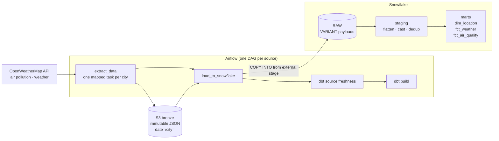

# EU Weather & Air Quality — an ELT platform

Two daily Airflow pipelines pull hourly weather and air-pollution observations for five European capitals from the OpenWeatherMap API, land them as immutable JSON in an S3 bronze layer, load them into Snowflake, and model them with dbt into a small tested star schema. Everything — AWS and Snowflake alike — is provisioned by Terraform and deployed by GitHub Actions.

<p>
  
  
  
  
  
  
</p>

This is a personal engineering project, not a product and not a tutorial follow-along. Its purpose is to practise the parts of data engineering that only show up when a pipeline has to survive being re-run, redeployed and debugged: idempotent loads, a raw layer you can actually rebuild from, tests that assert properties rather than decorate them, and infrastructure described in code. It is still being built. [Project status](#project-status) says plainly what works, what is known to be broken, and why.

If you are reviewing this repository and have ten minutes, read [Design decisions](#design-decisions) and then [`docs/adr/0003-immutable-bronze-layer.md`](docs/adr/0003-immutable-bronze-layer.md). That ADR starts from a failing data test and ends at a structural defect in how raw objects were named; it is the most representative thing here.

---

## Contents

- [What it does](#what-it-does)
- [Repository layout](#repository-layout)
- [Design decisions](#design-decisions)
- [Data model](#data-model)
- [Testing](#testing)
- [CI/CD](#cicd)
- [Infrastructure](#infrastructure)
- [Running it locally](#running-it-locally)
- [Deploying it to AWS](#deploying-it-to-aws)
- [Project status](#project-status)

---

## What it does



Both DAGs — [`weather_snowflake_dag`](dags/weather_snowflake_dag.py) and [`air_pollution_snowflake_dag`](dags/air_pollution_snowflake_dag.py) — run daily and have the same five-step shape.

**1. Read the city list.** Warsaw, Berlin, Paris, Rome and Madrid, with coordinates, come from [`dbt_project/seeds/cities_config.csv`](dbt_project/seeds/cities_config.csv). That file is the single source of truth for two consumers: Airflow reads it to know what to extract, and dbt seeds it to build `dim_location`. Adding a city is a one-line change in one file.

**2. Extract, one mapped task per city.** Airflow's dynamic task mapping (`.expand()`) fans out over the city list, so a failure is scoped to one city rather than the run. The API client retries 5xx responses with exponential backoff, reuses a pooled session, and paginates the weather timeline endpoint forward by timestamp with a page-count guard against infinite loops. A city for which the API returns nothing raises `AirflowSkipException` rather than writing an empty object.

**3. Write to bronze.** The raw payload is stored as-is, unparsed, under a key built by one function that both the writer and the reader call — [`plugins/common/utils/bronze_paths.py`](plugins/common/utils/bronze_paths.py):

```
bronze/weather/date=2026-06-27/city=Warsaw/20260627000000_20260628221104_part_1.json
```

The two timestamps are the logical date and the wall-clock moment of the write attempt. Two runs of the same date therefore cannot collide on a key. Why that matters is [below](#1-bronze-is-immutable).

**4. Load into Snowflake.** A single `COPY INTO` per run addresses the *partition prefix for the logical date* rather than a list of keys, with `FORCE = FALSE` and `LOAD_UNCERTAIN_FILES = TRUE`. Whatever sits under that prefix and is not yet in the table gets loaded, no matter which run wrote it. See [`snowflake_client.py`](plugins/common/clients/snowflake_client.py).

**5. Transform and test.** `dbt source freshness` runs first as a post-load assertion, then `dbt build` runs models and tests for the vertical this DAG owns (`--select +fct_weather` or `+fct_air_quality`).

---

## Repository layout

```
.
├── dags/                 Thin DAG definitions — orchestration only, no business logic
├── plugins/
│   ├── common/
│   │   ├── clients/      OpenWeather API, S3, Snowflake — dependency-injected, unit-tested
│   │   ├── config/       pydantic-settings, cities loader, sources.yml registry
│   │   └── utils/        Bronze key layout, dbt command builder
│   └── pipelines/        Pure extract functions, one package per pipeline
├── dbt_project/
│   ├── models/
│   │   ├── staging/      Flatten JSON, cast, round coordinates, deduplicate
│   │   └── marts/core/   dim_location, fct_weather, fct_air_quality
│   ├── macros/           round_coordinate — the coordinate-precision contract
│   ├── seeds/            cities_config.csv
│   └── tests/            Singular SQL tests
├── docs/adr/             Architecture decision records
├── terraform/            AWS + Snowflake infrastructure
├── tests/                pytest: clients, extract functions, DAG contracts
├── docker/airflow/       Airflow image with an isolated dbt venv
└── .github/workflows/    CI/CD
```

Two conventions worth naming, because they shape everything above.

**DAG files contain no business logic.** They wire tasks together and inject clients; the logic they call lives in `plugins/pipelines/` as plain functions with clients passed in as arguments. That is what makes extraction testable without an Airflow runtime — see [`tests/pipelines/`](tests/pipelines/).

**Heavy imports live inside task functions,** not at module scope, so the DAG processor parses files quickly.

---

## Design decisions

Non-obvious decisions are recorded as ADRs in [`docs/adr/`](docs/adr/) — context, decision, alternatives considered, consequences. The rule for writing one, and the reason the practice started later than it should have, are in [ADR-0001](docs/adr/0001-record-architecture-decisions.md). Accepted ADRs are immutable: a decision that changes gets a new ADR rather than an edit.

### 1. Bronze is immutable

**→ [ADR-0003](docs/adr/0003-immutable-bronze-layer.md)**

A completeness test reported 12 hourly rows instead of 24 for one city on one date. Tracing it back found two objects in S3 for that date whose modification times were 2.5 days apart, only one of which existed in Snowflake.

The root cause was that a bronze key was fully determined by city, logical date and chunk index. A re-run therefore competed for the same object names as the original run: it overwrote what it could and orphaned what it could not. Meanwhile `RAW` accumulated the union of everything ever loaded and was never truncated. One collection only grew, the other was overwritten in place, and the two diverged in *both* directions — S3 held 16 hours for that city and date, `RAW` held 12.

That breaks the only guarantee a bronze layer exists to provide: that every layer below it can be rebuilt from it. Without it, storing raw JSON is just a storage bill.

The fix is a naming rule rather than a mechanism. Every key carries the moment of the write attempt, to the left of the chunk index so that the ordering stays chronological — the staging deduplication uses `_source_file` as a tie-breaker and depends on that. Bronze now grows monotonically, as does `RAW`, and the two agree by construction. Corrections happen in staging, which already prefers the most recent load. Deleting from bronze is permitted only as an age-based lifecycle policy, never as a side effect of re-running a DAG.

*Rejected:* deleting leftovers before writing (moves the divergence to the unrecoverable direction); loading the whole prefix while keeping mutable keys (does not recover data that overwriting already destroyed); adopting Iceberg or Delta (solves this correctly in general, disproportionate here — the property needed is immutability, and a naming convention delivers it directly).

### 2. The load addresses a prefix, not a file list

**→ [ADR-0004](docs/adr/0004-load-bronze-by-partition-prefix.md)**

`COPY INTO ... FILES = (...)` answers "what did this run write". The question a load has to answer is "what is in bronze that is not yet in `RAW`". Those coincide only when every run succeeds. When an extract wrote objects and the load never ran, the keys vanished with the run and nothing would ever offer those objects to Snowflake again.

So the load now scopes to the partition prefix for the logical date and lets Snowflake's load metadata decide what is new. `FORCE = FALSE` skips what is already loaded; `LOAD_UNCERTAIN_FILES = TRUE` attempts objects whose metadata has expired rather than skipping them silently.

Two consequences follow, and both were the point. Repairing a date becomes an operation the pipeline supports — re-run it, and anything stranded under that prefix is picked up. And since the load no longer consumes the extract's return value, it depends on the extracts only for ordering: its trigger rule became `NONE_FAILED_MIN_ONE_SUCCESS`, so one silent city stops cancelling the load for the other four.

The layout change that made prefixes addressable by date — `date=` above `city=`, as a single path segment — belongs to the same decision. A single segment keeps a date range expressible as a string comparison; `year=/month=/day=` would buy whole-month prefixes that nothing here asks for, at the cost of turning every range query into a disjunction across boundaries.

*Rejected:* Snowpipe (right destination if loading is ever decoupled from the orchestrator, but it makes the load asynchronous, so the DAG can no longer tell whether the data arrived); a self-maintained registry of loaded objects (more precise than load metadata, and immune to its 64-day expiry, but it buys precision these volumes do not need at the cost of code that has to be correct about partial failures); external tables over bronze (removes `_RAW_LOADED_AT`, which the deduplication orders by).

### 3. Completeness and correctness are tested with different instruments

**→ [ADR-0002](docs/adr/0002-measure-completeness-testing-policy.md)**

A range test asserts correctness: if a value arrived, it must be sane. `not_null` asserts completeness: a value was *required* to arrive. The second is a claim about the source contract, and a claim about the source needs evidence — so NULL counts were queried in Snowflake across all loaded data before the policy was written.

Every column now falls into exactly one of three categories. Structural columns (grain, keys) and measures the source must always return carry `not_null` at default severity. Measures whose absence is a legitimate state — `rain_1h_mm`, `snow_1h_mm`, `wind_gust_metre_per_sec` — carry no `not_null`; instead their description is *required* to state what NULL means there. For rain, NULL means none was reported, not unknown, and the two readings imply different aggregations downstream.

Any deviation from default severity requires an adjacent comment giving the reason and the condition for removing it. A test whose justification is not written down is superstition, and a permanently yellow warning is one nobody reads.

### 4. Coordinate precision is a contract, not a formatting choice

Facts join to `dim_location` on rounded latitude and longitude, so the rounding rule *is* the join key. It lives in exactly one place — the [`round_coordinate`](dbt_project/macros/round_coordinate.sql) macro — and the latitude and longitude columns of all four models that expose them are documented from a single pair of shared doc blocks in [`_shared_contract_docs.md`](dbt_project/models/_shared_contract_docs.md), rather than four hand-written descriptions that could quietly disagree.

The failure mode is what makes this worth centralising. If one model drifts to a different precision, dbt still builds successfully. The join simply starts returning NULL `location_id`, silently, and is caught only by the `not_null` and `relationships` tests on the marts. That is also why those key tests exist on the marts even though the measures beside them are untested there: the join is what can break them, and the measures merely pass through.

### 5. Source freshness runs as a post-load assertion

`dbt source freshness` sits between the load and the build, selected to the source that DAG owns, and reads `_RAW_LOADED_AT` with a one-hour warning and three-hour error threshold.

It is placed there to catch a specific silent failure. A `COPY INTO` over a prefix that matches nothing is not an error — the statement succeeds, zero files load, the task goes green. A typo in `s3_prefix` or a drifted date format would therefore produce a pipeline that reports success and loads nothing. Freshness immediately after the load is what turns that into a failure.

---

## Data model

| Model | Grain | Notes |
|---|---|---|
| `stg_openweather__weather` | one row per coordinate pair per hour | `LATERAL FLATTEN` of the payload, `try_cast` on every measure, surrogate key, `qualify` deduplication |
| `stg_openweather__air_quality` | one row per coordinate pair per hour | same shape |
| `stg_internal__locations` | one row per configured city | built from the seed; the only path from `cities_config.csv` into the marts |
| `dim_location` | one row per location | |
| `fct_weather` | one row per location per hour | atomic fact — measures pass through unchanged |
| `fct_air_quality` | one row per location per hour | atomic fact |

Model documentation follows a fixed standard, set on [`fct_weather.yml`](dbt_project/models/marts/core/fct_weather.yml) and applied to every model. Each model states its grain as a sentence. Each measure states its unit, its **permitted aggregation**, and its traps. So `rain_1h_mm` is documented as additive but with NULL meaning "none reported" rather than zero — which makes `AVG` over all rows answer a different question than a reader expects. `wind_direction_degree` is documented as aggregatable by neither `SUM` nor `AVG`, because the scale wraps and the mean of 350° and 10° is 180°, the opposite direction. A description that only restates the column name counts as missing.

`fct_weather` deliberately drops columns rather than passing everything through. `temperature_feels_like_celsius` is derived and belongs where the formula is owned. `weather_description`, `weather_group` and `weather_icon_id` are attributes of a lookup determined by the condition code, so only `weather_condition_id` survives, as a foreign key to a dimension that does not exist yet — cheap now, and it avoids a reload later.

---

## Testing

Three levels, plus one deliberate gap.

**Python** ([`tests/`](tests/)). Client units against `requests_mock` cover retry configuration, timeouts, exhausted retries, URL construction, pagination and the boundary-hour filter. Bronze key tests pin the layout invariants directly: that `object_key` always nests under its own `partition_prefix` (the single thing keeping the writer and the reader on one date format), that two attempts on the same logical date produce different keys, and that file names sort by write attempt regardless of chunk index. Snowflake client tests assert the generated SQL scopes to the prefix, is idempotent, and allows uncertain files.

**DAG contracts**, a subset of those. Both DAGs are asserted against an explicit expected task set, their dependency chain, their schedule and retry settings, the trigger rule that lets the load tolerate skipped cities, and the exact dbt selectors each Bash task renders. A careless edit to the graph fails CI rather than production.

**dbt — data tests plus one singular test.** Uniqueness and not-null on surrogate keys, `relationships` from both facts to `dim_location`, `dbt_utils.unique_combination_of_columns` on both fact grains, `accepted_range` on the measures (concentrations non-negative, visibility capped at 10 000 m, percentage and degree scales bounded), `accepted_values` on the AQI scale, and `dbt_utils.recency` on both staging models.

**What the tests do not catch, stated on purpose.** `assert_fct_weather_has_24_hours_per_location_day` groups the rows that exist and compares each group to 24, so it sees a day missing one hour but cannot see a day missing entirely — no rows means no group to compare. Catching an absent date requires a calendar dimension, which does not exist yet. Likewise, `dbt parse` in CI builds the graph without executing SQL, so a wrong column name passes CI and fails only on a real `dbt build`. Saying "CI validates dbt" without that qualifier would be misleading.

```bash
make check     # ruff + mypy + dbt deps/parse + pytest
make lint      # ruff check, ruff format --check, mypy
make lint_dbt  # dbt deps + dbt parse against the CI target
make lint_tf   # terraform fmt -check, init -backend=false, validate
make test      # pytest
```

`lint_tf` is deliberately outside `check`: the dev container has no Terraform, and running `init` from both Linux and a Windows host into the same mounted `.terraform/` would leave them overwriting each other's plugins.

---

## CI/CD

[`.github/workflows/ci_cd.yml`](.github/workflows/ci_cd.yml). Every pull request into `main` runs the full integration job: ruff, mypy, `terraform fmt -check` → `init -backend=false` → `validate`, `dbt deps` → `dbt parse` against a dummy CI target, then pytest. The dbt and Terraform checks were added after deliberately breaking things five ways — malformed Jinja, a `ref()` pointing nowhere, a reference to a non-existent Terraform resource, bad formatting, and a Terraform version outside `required_version` — and confirming each turned CI red.

On merge to `main`, the image is built and pushed to ECR using GitHub OIDC, so no long-lived AWS keys exist as repository secrets. The ECS task definition is re-rendered for all three containers with the new image **digest**, not a tag, and the service waits for stability. The deploy job is serialised with a concurrency group so two merges cannot roll the service at once.

One caveat inherited from GitHub, worth knowing before it confuses someone: `cancel-in-progress: false` protects the *running* deployment but keeps only one job queued behind it. Three rapid merges deploy the first and the third; the second is cancelled silently.

---

## Infrastructure

All of it is Terraform ([`terraform/`](terraform/)), both cloud sides: AWS (VPC, ECS Fargate, RDS, S3, ECR, Secrets Manager, IAM, GitHub OIDC provider) and Snowflake (databases, schemas, raw tables, storage integration, external stages, warehouse, service user, roles and grants).

**Airflow runs as one ECS Fargate task with three containers** — apiserver, scheduler and standalone DAG processor — sharing a network namespace, at 0.5 vCPU and 3 GB. `LocalExecutor`, because Celery and Redis would be pure overhead at one DAG run per day. Airflow metadata lives in RDS Postgres 17.7 on `db.t4g.micro`.

**Cost is a design constraint, and the choices are visible in code.** All tasks run on `FARGATE_SPOT`. There is no NAT gateway — tasks sit in public subnets with a public IP and a security group that admits only the UI port from a configured CIDR list; the NAT resources exist behind a flag that defaults to off. CloudWatch retention is five days, with task logs shipped to S3 by Airflow's remote logging. The Snowflake warehouse is `XSMALL`, starts suspended and auto-suspends after 60 seconds.

**Credentials never appear in a task definition.** Secrets Manager holds the OpenWeather key, a JSON blob of Airflow's internal secrets, and two Snowflake credential blobs; ECS injects individual JSON keys as environment variables at container start. Snowflake service users authenticate with an RSA key pair generated by Terraform — no passwords. `AIRFLOW_CONN_AWS_DEFAULT` is set to bare `aws://`, which tells Airflow to use the task role rather than any static key.

**The Snowflake ↔ S3 trust needs two applies, and that is not a workaround.** The dependency is genuinely circular: the AWS role must exist before Snowflake can be told which role to assume, but Snowflake only generates the IAM principal and external ID identifying itself when the storage integration is created — which is after the role. So the role is created with a placeholder trust policy, and a second apply narrows it once those values exist. The first apply emits both as ready-to-run `export` commands. Full walkthrough in [Deploying it to AWS](#deploying-it-to-aws).

---

## Running it locally

Requires Docker and Docker Compose, plus an OpenWeatherMap API key. Snowflake and AWS credentials are only needed for the load and dbt steps; extraction to S3 needs an S3 bucket.

```bash
git clone https://github.com/sqisitoo/my_elt_project.git
cd my_elt_project

cp .env.template .env
# fill in: API_KEY, AWS_*, SNOWFLAKE_*

docker compose up -d
# Airflow UI: http://localhost:8080  (airflow / airflow)
```

DAGs are paused at creation, so nothing runs until you unpause it. `__test_dbt_integration` is a schedule-less debug DAG that runs `dbt debug` — the fastest way to confirm the dbt venv and Snowflake credentials inside the image are wired correctly.

For linting and tests outside the container:

```bash
make install_deps   # installs against the Airflow constraints file for 3.1.6 / Python 3.10
make check
```

---

## Deploying it to AWS

The full runbook — prerequisites, Snowflake bootstrap, both applies, first image, first run, teardown, and the known limitations of the deployment — is **[`docs/deployment.md`](docs/deployment.md)**. The shape of it:

1. **Bootstrap Snowflake by hand** ([`terraform/scripts/bootstrap.sql`](terraform/scripts/bootstrap.sql)). Terraform manages Snowflake through a service user, so that user, its RSA key pair and its role have to exist before the first apply. The role's three grants each cover something the others do not: `SYSADMIN` for databases and warehouses, `SECURITYADMIN` for creating the Airflow role and user, and `CREATE INTEGRATION ON ACCOUNT` for the storage integration, which is an account-level object neither of the first two reaches.
2. **`terraform apply`.** Everything is created, and the external stages do not work yet — the IAM role Snowflake needs to assume exists, but its trust policy is a placeholder pointing at your own account.
3. **`terraform apply` again,** with the IAM user ARN and external ID that Snowflake generated in step 2 fed back as `TF_VAR_*` variables. Only now can the trust policy name Snowflake's principal and require the matching external ID — the condition that prevents a confused-deputy attack on the role. Why this cannot be one apply is explained [above](#infrastructure).
4. **Push an image.** The task definition references a tag that does not exist until the first build, so the service sits there failing to start until CI (or you) puts an image in ECR.
5. **Unpause the debug DAG first.** `__test_dbt_integration` runs `dbt debug` and nothing else, which is a ten-second answer to "did the Snowflake credentials survive the trip through Secrets Manager" instead of finding out inside a five-task run.

Configuration that cannot be committed has documented examples beside it: [`terraform.tfvars.example`](terraform/terraform.tfvars.example) and [`backend.conf.example`](terraform/backend.conf.example).

---

## Project status

The project has an explicit finish line. It is done when five statements are true: this README explains the project to a stranger without me; CI catches everything that currently breaks silently; the warehouse is clean and a full dbt build over all history is green; the pipeline is *operated* rather than demonstrated, with at least two weeks of runs and failures that produce an alert rather than silence; and the infrastructure has no dead parts, with warehouse layers separated and dbt decoupled from Airflow. Anything beyond those five is deliberate debt, to be done after the finish line or not at all.

**Working today**

- Both verticals are complete and symmetrical: extract → load → source freshness → dbt build and test, for weather and air pollution alike.
- Immutable bronze and prefix-scoped loading, as described above.
- Six dbt models, all documented to the project standard, covered by data tests and one singular test.
- Python tests, including DAG contract tests, all running on every pull request alongside Terraform and dbt validation.
- Full AWS and Snowflake footprint in Terraform, with deploys to ECS on merge.

**Known limitations — the honest list**

- **There is barely any history yet.** The warehouse was wiped clean on 2026-08-15 — bronze in S3 and the `RAW` tables — once the pipeline had stopped producing garbage (the two ADRs above). The order was deliberate: first stop the leak, then mop. Backfilling the lost history was considered and rejected: it is not yet a data product, and paying Snowflake credits to reconstruct development data is not worth it. History accumulates from that date forward, so anything that needs a long window has to wait.
- **Every dbt model materialises into `RAW.AIR_POLLUTION`,** because `SNOWFLAKE_DATABASE=RAW` is passed to the container and `dbt_project.yml` sets no per-layer database or schema. `stg_openweather__weather` therefore reads from `RAW.WEATHER` and writes into its neighbour's schema. An `ANALYTICS` database is provisioned by Terraform and currently unused. Tracked as issue #44; it is the second step of the infrastructure phase.
- **Failures are silent.** There is no alerting yet (issue #48). Note what tests structurally cannot cover here: a test lives inside a DAG, so "the pipeline did not run at all" is invisible to `source freshness` and to every test on the marts. It needs an outside observer.
- **The daily completeness signal is not yet fit for daily reading.** The 24-hours-per-day test inspects the entire history on every run, so the first unrecoverable gap makes it permanently red — and a permanently red test is one nobody reads. It needs splitting into an archival test outside the daily run and a recent-window test inside it.
- **Marts are views** (no materialisation config, so dbt's default applies) and nothing is incremental. Fine at five cities and hourly grain; not a pattern to copy at scale.
- **`dbt-snowflake` is installed unpinned in the image.** Reproducibility of the image therefore depends on when it was built.
- **Some infrastructure is dead or legacy.** The bastion host and NAT gateway exist behind flags that default to off, and a few `DB_*` environment variables survive from a removed Postgres ETL. Issue #45; first step of the infrastructure phase.
- **`stg_openweather__weather` keeps only the first element of the API's weather-conditions array.** If a response carries both rain and mist, the second is dropped before any tested table exists, so no test can catch it.

**Next, in order**

1. Infrastructure, cheapest step first:
   - a. Remove the dead resources — the bastion host and what remains of the retired Postgres ETL (#45).
   - b. Separate the warehouse layers, so that no model writes into its neighbour's schema (#44).
   - c. Make failures visible: alerting (#48). This is what tests structurally cannot do, since a test lives inside the DAG it is testing.
   - d. Refactor the existing Terraform, until there is no resource whose purpose and shape I cannot defend in review.
   - e. Decouple dbt from Airflow — they share one image today. The Cosmos question is answered here, as part of the same decision, rather than as a separate step afterwards.
2. Operate it: at least two weeks of runs and one real incident worked through. The architecture diagram and an operations section land here, once the shape of the infrastructure has stopped moving.
3. A consumption layer on top of the accumulated clean data.

Deliberately **not** planned, so that the scope stays finite: Kafka or streaming, Kubernetes, Great Expectations on top of dbt tests, the dbt Semantic Layer, and a third data source before the finish line.

---

## Author

**Vladislav Kizilov** — Data Engineer

[GitHub](https://github.com/sqisitoo) · [Email](mailto:kizilovladislav@gmail.com) · [LinkedIn](https://www.linkedin.com/in/vladyslav-kyzylov-de/)

<sub>A personal portfolio project, not affiliated with OpenWeatherMap.</sub>
